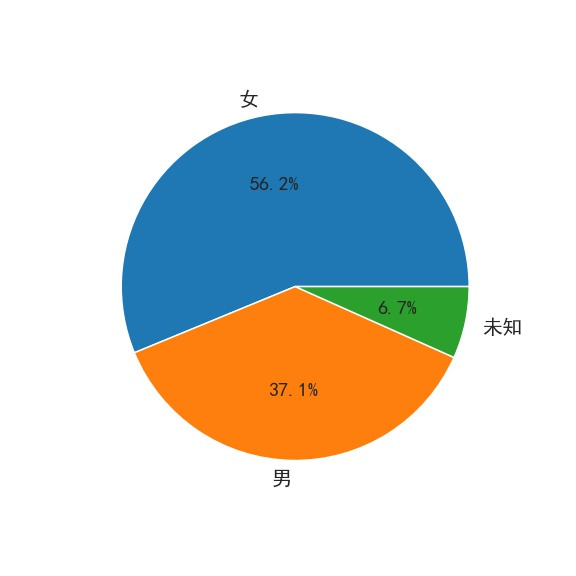
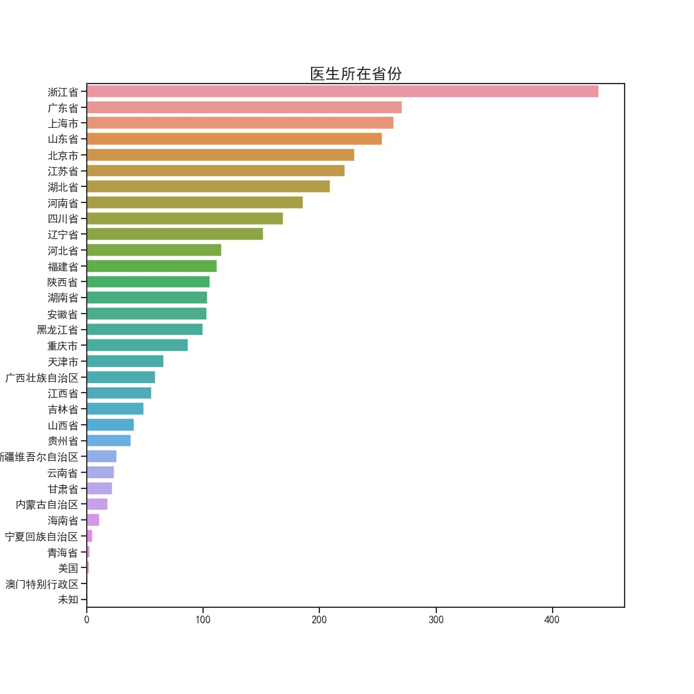
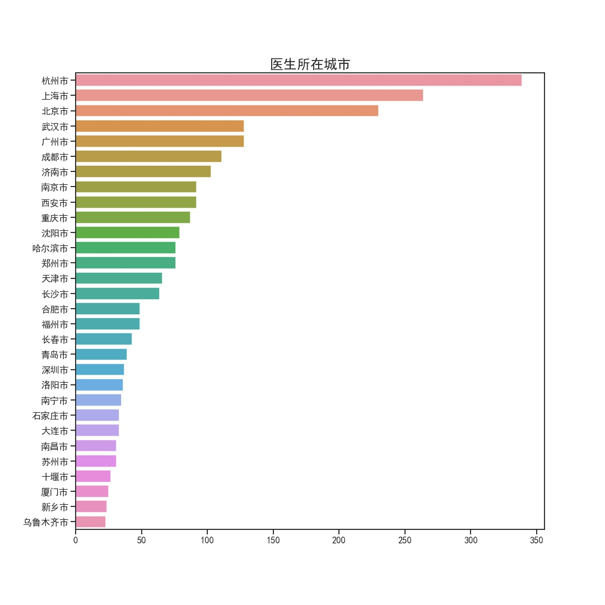
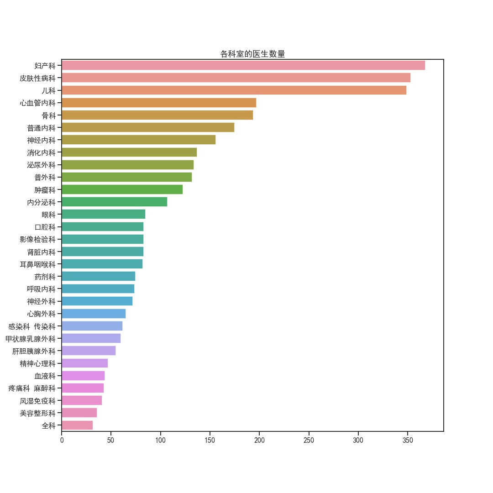
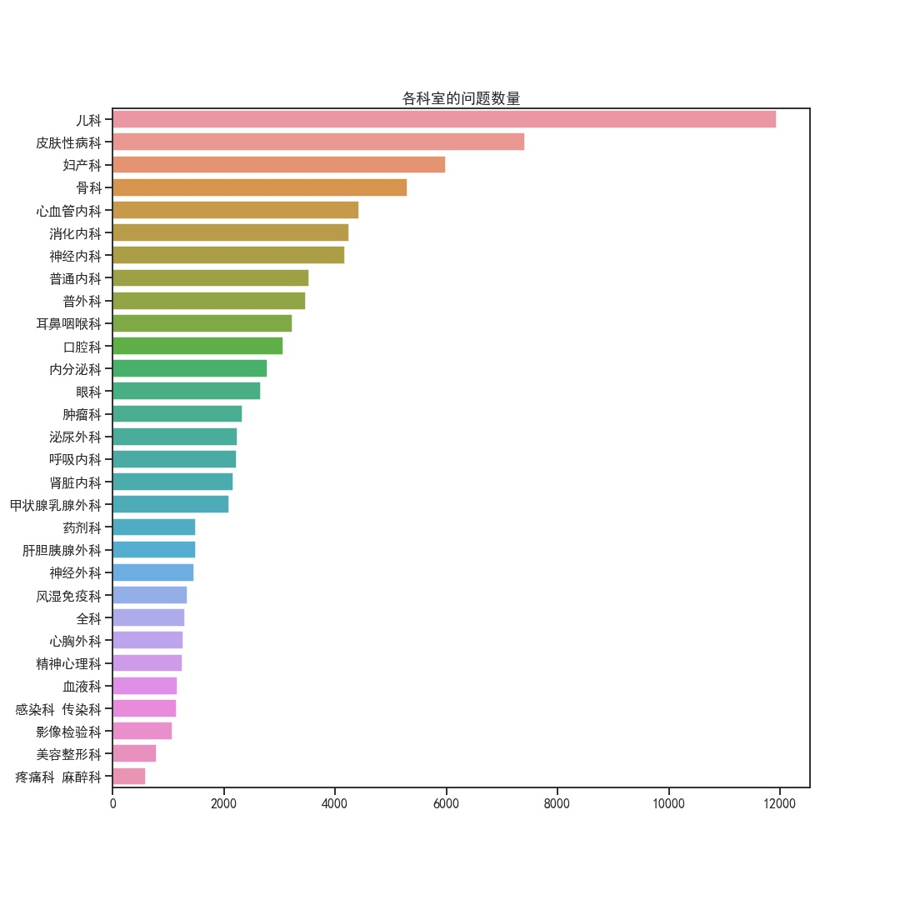

# 概述
灵感来自：https://github.com/wdkwdkwdk/fuck_illness

为了分析网络上疾病问答的数据而编写的爬虫和分析程序。爬虫使用scrapy框架，爬取了丁香问答上的数据。
# 爬虫
遍历问题id爬取问题、回答、追问、医生信息、患者信息等数据，存放于sqlite。
爬虫使用了scrapy框架，先爬取丁香医生网站上的医生信息，然后再根据每个医生主页上列出的问答信息爬取医疗问答数据。
所有这些爬虫都需要使用随机ip和随机user-agents来避免被反爬虫，所以要设置scrapy的中间件。
```python
'DOWNLOADER_MIDDLEWARES': {
    'scrapy.downloadermiddlewares.retry.RetryMiddleware': 190,
    'medic.scrapy_proxies.ProxyMiddleware': 200,
    'scrapy.downloadermiddlewares.httpproxy.HttpProxyMiddleware': 210,
    'random_useragent.RandomUserAgentMiddleware': 150,
    'scrapy.contrib.downloadermiddleware.useragent.UserAgentMiddleware': None,
}
```
`random_useragent`来源[这里](https://github.com/cnu/scrapy-random-useragent)，基本上就是从`USER_AGENT_LIST`参数所指定的文件中读取user-agents，然后每个request随机选取一个。
`scrapy_proxies`是我开发的一个HTTP代理的中间件，从`PROXY_API`中获取一个代理地址，将它赋值给接下来的所有requests。如果发现downloader返回的response的数据有误，则说明该代理ip被封了，则需要重新获取一个代理地址给接下来的requests用。之所以这样做而不是每个request随机选取一个ip地址，主要是我用的api获取频率有限制。
`RetryMiddleware`会将失败的requests重新放回scheduler当中，在其它request都完成之后重试这些失败的requests。
Item Pipeline设置如下：
```python
'ITEM_PIPELINES': {
    'medic.pipelines.DxAdvPipeline': 300,
},
```
这个Pipeline主要是将爬取到的医生数据和问答数据分别存放到数据库中的doctors表和dialogs表。


# 分析
分析的过程和代码都在'Analyze.ipynb`文件中，用jupyter notebook打开即可
首先我们来看看在网上参与问答的医生的数据，明显女医生比男医生更多


医生所在的省份如下：

医生最多的前30名城市如下：

可以看到回答问题的医生主要集中在山东、广东、浙江、江苏、北京、上海等沿海发达地区，而丁香医生的总部浙江省的数量独占鳌头，浙江省大部分医生都在杭州市，看来丁香医生在杭州的推广十分成功。这些地区一方面医疗水平更加发达，医生数量更多、质量更高，另一方面互联网也更加普及，促进了在线医疗问答的发展。


在医生的科室上，可以看到妇产科、皮肤病科和儿科的医生数量较多，这可能是由于这些科室许多疾病症状较轻，许多疾病并不严重，适合网络提问,，很多人也许都希望在网上先行询问再来决定是否就医。

在问答数据方面，我们先来看一下这些问题都集中在哪些科室

和之前医生集中的科室相比较可以发现，前三名依旧是妇产科、皮肤病科和儿科，但儿科的问题要远大于其它科室，我推测可以归咎于以下几个原因：
1. 父母对于儿童生病比成年人生病更加敏感，毕竟自己的宝宝马虎不得。婴幼儿又无法像青少年和成人那样用语言描述自己的症状，因此父母对于任何症状都十分担心，想寻求医生的帮助。
1. 如今新一代的父母对互联网更加熟悉，遇到许多问题更倾向于在网络上解决。
1. 如今儿科医生紧缺，去医院往往要排长队，先行在网络上提问有助于诊断，可以免去排长队的困扰。

我们也可以看出如今我国儿科医生的负担确实很重，在医生数量和皮肤病差不多的情况下要应付多一倍的问题。